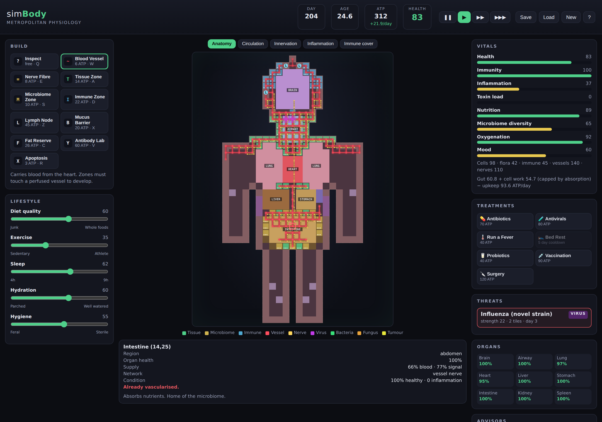

# simBody

**SimCity, but the city is a human body.**

You are not a doctor. You are the city planner of a body: you lay the
infrastructure, zone the land, balance a budget, and deal with the disasters
that show up uninvited — except here the infrastructure is blood vessels and
nerves, the citizens are cells and gut bacteria, the budget is ATP, and the
disasters are influenza, food poisoning and the occasional rogue cell cluster.



Runs in any modern browser. No build step, no dependencies, no network calls.

```bash
git clone https://github.com/aidentools/bodysim.git
cd bodysim
npm start            # serves on http://localhost:8080
```

(Or just open `index.html` — everything is plain scripts, so `file://` works too.)

## How it plays

| SimCity | simBody |
| --- | --- |
| Roads | **Blood vessels** — spread out from the heart, and only so far |
| Power lines | **Nerve fibres** — spread from the brain, gate high-density growth |
| Residential zones | **Tissue** — working cells that produce and consume ATP |
| Commercial zones | **Microbiome** — gut flora, fed by dietary fibre |
| Industrial zones | **Immune posts** — defend the body, generate inflammation |
| Taxes and budget | **ATP**, earned by the gut and by well-supplied cells |
| Pollution | **Inflammation and toxins**, cleared by sleep, flora, liver and kidneys |
| Earthquakes and fires | **Infections** that enter through the airway, gut or skin and spread tile by tile |

### The loop

1. **Vascularise.** Blood spreads from the heart along vessels you draw, losing
   pressure with distance. Zones that aren't perfused don't develop, and starved
   tissue dies back. A fit heart (exercise slider) pushes blood further.
2. **Feed the budget.** ATP income comes from the gut, and gut absorption scales
   with how much developed, well-perfused gut lining you have. Zoning the gut
   lining and running vessels to it is the single highest-return move in the game.
3. **Farm the microbiome.** Flora live on dietary fibre, not blood. They produce
   the short-chain fatty acids that hold inflammation down — the closest thing
   the game has to a win condition for the long term.
4. **Defend proportionately.** Immune zones fight infections near them, doubled
   by an adjacent lymph node. But every post costs ATP and adds background
   inflammation, and chronic inflammation quietly wrecks every organ you own.
5. **Survive the disasters.** Pathogens pick an entry point, then spread tile by
   tile. You can out-immune them, drug them, or seal the door with a mucus
   barrier before they ever get in.

### The hard trade-offs

- **Antibiotics** end a bacterial infection in a day and gut your microbiome for
  weeks. Sometimes still the right call.
- **Bed rest** cuts inflammation hard but slashes income for three days.
- **Hygiene** lowers infection risk and starves microbiome diversity.
- **Sleep** is your best anti-inflammatory and your biggest opportunity cost.
- **Fat reserves** buy you ATP storage; past a few, they start inflaming you.

Do nothing at all and the body dies in roughly three to five months — not
dramatically, but the way bodies actually fail: a small deficit, then organs
that can't keep up with repairs, then an infection that doesn't clear.

## Controls

| Key | Action |
| --- | --- |
| `Q` `W` `E` | Inspect · Blood vessel · Nerve fibre |
| `A` `S` `D` | Tissue · Microbiome · Immune zone |
| `Z` `X` `C` `V` | Lymph node · Mucus barrier · Fat reserve · Antibody lab |
| `R` | Apoptosis (clear a tile) |
| `1`–`5` | Map overlays: anatomy, circulation, innervation, inflammation, immune cover |
| `Space` | Pause / resume |

Click and drag to paint. The game autosaves to `localStorage` every 20 days.

## Project layout

```
index.html        markup shell
css/styles.css    theme
js/data.js        tuning constants, build catalogue, diseases, treatments
js/map.js         procedural body: silhouette, organs, skin, starting anatomy
js/state.js       game state, seeded RNG, save/load
js/sim.js         the simulation — seven passes per in-game day
js/actions.js     player actions and placement rules
js/render.js      canvas rendering and overlays
js/ui.js          panels, tools, sliders, inspector, modals
js/main.js        bootstrap and the real-time loop
tests/run.js      test suite (no framework)
tests/balance.js  scripted-player harness for tuning
tests/neglect.js  how long an untended body lasts
```

### A day in the simulation

Each tick runs seven passes in order: **circulation** (breadth-first from the
heart along vessels), **innervation** (the same from the brain), **development**
(zones grow, starve or die back), **metabolism** (ATP in versus out),
**pathology** (outbreaks grow, spread, damage, and get fought), **homeostasis**
(inflammation, toxins, immunity, organ wear and repair, health), and **chance**
(new infections and conditions roll against your current risk profile).

The whole thing is deterministic given a seed, which is what makes the balance
harness useful.

## Development

```bash
npm test        # 30 assertions across map, economy, disease, save/load
npm run balance -- 11 600    # scripted player, seed 11, 600 days
npm run neglect              # how fast an untended body fails
```

The balance and neglect harnesses exist because tuning a simulation by playing it
is slow. If you change a constant in `js/data.js`, run both: `balance` should
survive most seeds with occasional crises, and `neglect` should always die.

## License

MIT.
